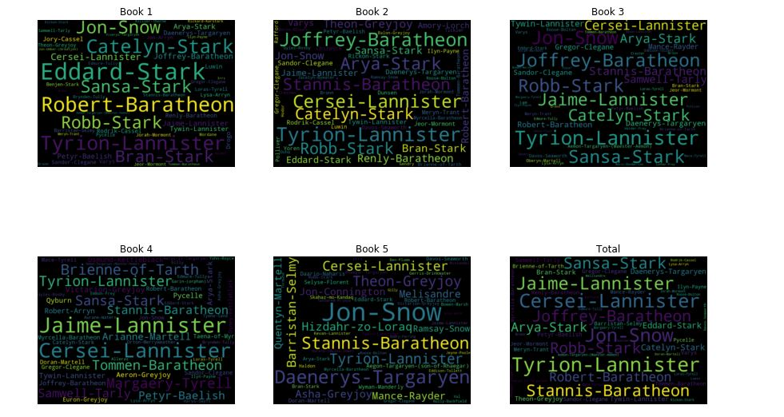
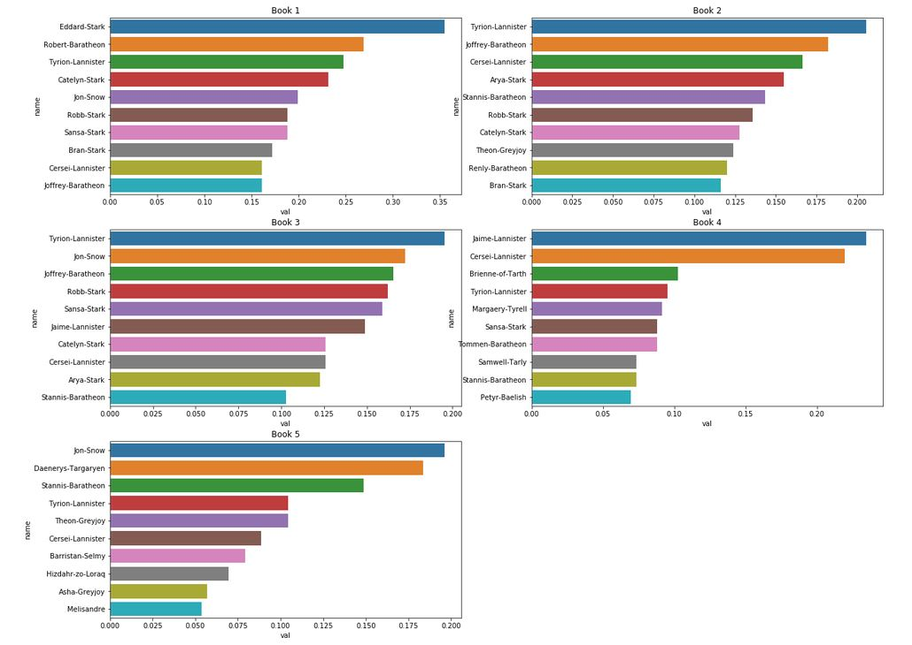
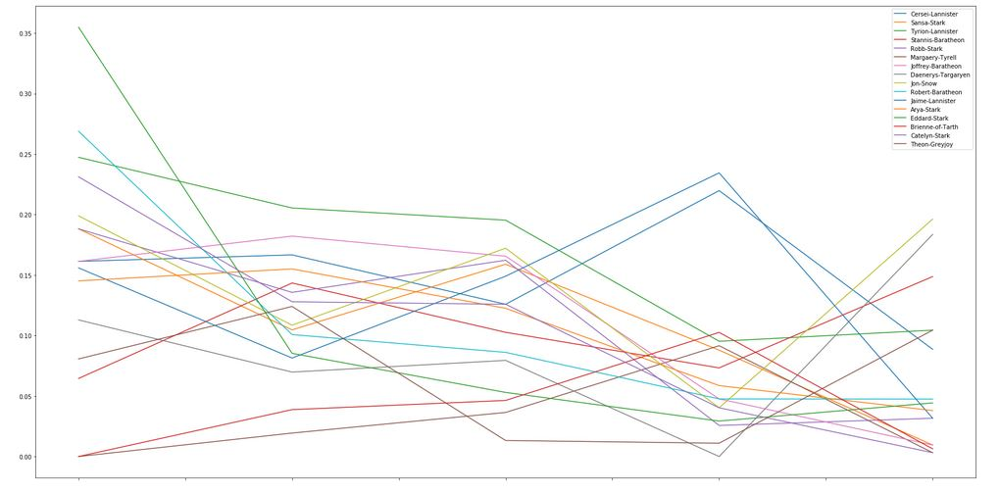

# Network Analysis - A Song of Ice and Fire
A Song of Ice and Fire is a popular book series by George R.R. Martin. So far he has published 5 books in this series. In this notebook we are going to analyse the co-occurrence network of the characters throughout these books. The dataset we use here is created by Andrew J. Beveridge and Jie Shan. The dataset is publicly available [here](https://github.com/mathbeveridge/asoiaf). In this dataset, two characters are considered to co-occur if their names appear in the vicinity of 15 words from one another in the books. The number of these co-occurences between two characters in a book is the weight of the edge that connects the two characters. Although it is not a perfect method, it can clearly show some of the important relationships between characters.  
Credits:  
    Mridul Seth's notebook : https://github.com/MridulS/pydata-networkx/blob/master/introduction-and-game-of-thrones-instructor.ipynb    

## Results

### Most common characters
 

### Degree of Centrality
 

## Character Evolution
 
